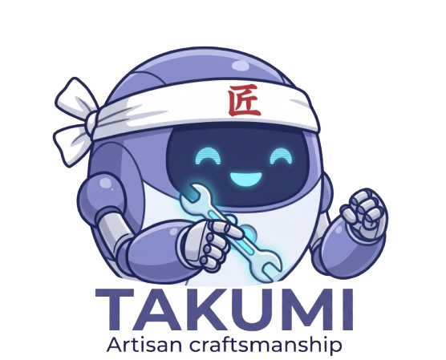

<p align="center">
  
</p>

<p align="center">
  
</p>

# Takumi — AI Organisation Platform

> **Takumi** (匠) — *artisan* or *craftsman* in Japanese. A Takumi is a master of their craft, combining deep expertise with meticulous attention to detail. This platform embodies that spirit: each AI agent is a specialist, crafted with purpose, working together as a skilled organisation.

Run a full AI organisation on your machine. Each agent has a specific role, its own system prompt, and its own LLM — keeping context lean and costs low.

---

## Prerequisites

- **Python 3.12+**
- **Node.js 18+**
- **Docker** — required for web search (SearXNG). Make sure Docker Desktop is running before starting Takumi.

---

## Quick start

### Option A — one command (recommended)

```bash
chmod +x start.sh
./start.sh
```

This starts SearXNG (web search), creates the Python venv, installs all dependencies, and launches both servers.

> **Note:** Docker Desktop must be running first. If Docker is not available, Takumi still works but agents won't be able to search the web.

### Option B — manual (run each in a separate terminal)

**Terminal 1 — Backend**

```bash
# Run from the project root

# First run only: create venv and install packages
python3 -m venv .venv
.venv/bin/pip install -r backend/requirements.txt

# Start the server
.venv/bin/python -m uvicorn backend.main:app --host 0.0.0.0 --port 8000 --reload --reload-dir backend
```

**Terminal 2 — Frontend**

```bash
cd frontend

# First run only: install node packages
npm install

# Start the dev server
npm run dev
```

**Terminal 3 — SearXNG (web search engine)**

```bash
docker compose up -d
```

Open **http://localhost:5173** in your browser.

> The backend API runs on **port 8000**. The frontend dev server on **port 5173** proxies all `/api` and `/ws` requests to the backend automatically.

---

## First run — setup wizard

On first launch the app shows a 3-step setup wizard:

1. **Organisation** — give your AI company a name
2. **LLM** — pick a provider, enter credentials, and test the connection
3. **Team** — add specialist agents (use **✨ Enhance with AI** to generate system prompts)

Configuration is saved to `data/runtime_settings.json` (gitignored). The wizard is skipped on subsequent launches.

---

## Environment variables

Copy `.env.example` to `.env` and fill in the keys you need:

```bash
cp .env.example .env
```

| Variable            | Provider         | Notes                                      |
|---------------------|------------------|--------------------------------------------|
| `ANTHROPIC_API_KEY` | Anthropic        | `sk-ant-...`                               |
| `OPENAI_API_KEY`    | OpenAI           | `sk-...`                                   |
| `GOOGLE_API_KEY`    | Google Gemini    | `AIza...`                                  |
| `GLM_API_KEY`       | Zhipu GLM        |                                            |
| `MINIMAX_API_KEY`   | MiniMax          | Also set `MINIMAX_GROUP_ID`                |
| `OLLAMA_BASE_URL`   | Ollama / Cloud   | Default `http://localhost:11434`           |
| `OLLAMA_API_KEY`    | Ollama Cloud     | Bearer key from ollama.com/settings/keys   |

Keys can also be entered through the setup wizard — no `.env` file required.

---

## Project structure

```
takumi/
├── docker-compose.yml            # SearXNG search engine
├── searxng/                      # SearXNG config
│   ├── settings.yml
│   └── limiter.toml
├── backend/                      # Python / FastAPI
│   ├── main.py                   # FastAPI app + WebSocket
│   ├── orchestrator.py           # 24/7 engine, agent lifecycle
│   ├── task_scheduler.py         # Recurring task scheduler
│   ├── runtime_settings.py       # Mutable org/LLM config (persisted to data/)
│   ├── config.py                 # Env-var settings (pydantic-settings)
│   ├── models.py                 # Pydantic data models
│   ├── message_bus.py            # Async inter-agent message routing
│   ├── persistence.py            # JSON persistence
│   ├── agents/
│   │   ├── base_agent.py         # Base class all agents extend
│   │   └── ceo_agent.py          # CEO — delegates tasks to specialists
│   ├── skills/                   # Agent skills (tools)
│   │   ├── registry.py           # Skill registry + tools prompt builder
│   │   └── web_search.py         # web_search & web_fetch via SearXNG
│   ├── llm_adapters/             # One adapter per provider
│   │   ├── anthropic_adapter.py
│   │   ├── openai_adapter.py
│   │   ├── ollama_adapter.py     # Ollama local + Cloud
│   │   ├── custom_adapter.py     # Any OpenAI-compatible endpoint
│   │   ├── gemini_adapter.py
│   │   ├── glm_adapter.py
│   │   ├── minimax_adapter.py
│   │   └── factory.py
│   └── api/
│       └── routes.py             # REST endpoints (/api/...)
└── frontend/                     # React / Vite / Tailwind
    └── src/
        ├── App.jsx               # Layout + sidebar navigation
        ├── stores/orgStore.js    # Zustand state (WebSocket + REST)
        └── components/
            ├── SetupWizard.jsx       # First-run onboarding wizard
            ├── ChatView.jsx          # Main chat interface
            ├── CronJobView.jsx       # Scheduled tasks
            ├── SkillMarketplaceView.jsx
            ├── WorkflowView.jsx
            ├── OfficeView.jsx        # Live agent desk view
            ├── APISettingsView.jsx   # Centralised API key store
            ├── ChannelView.jsx       # Telegram / WhatsApp / etc.
            ├── OrganisationView.jsx  # Agent roles & reporting lines
            ├── AgentDesk.jsx
            ├── AgentDetailPanel.jsx
            └── AgentModal.jsx
```

---

## How it works

1. You send a message → goes to the **CEO** agent
2. CEO analyses it and delegates sub-tasks to specialist agents via the **Message Bus**
3. Agents work independently, each with their own bounded context and LLM
4. Results flow back to the CEO who synthesises a final answer
5. The frontend receives all state changes in real-time via WebSocket

---

## Supported LLM providers

| Provider        | Notes                                              |
|-----------------|----------------------------------------------------|
| Anthropic       | Claude Haiku, Sonnet, Opus                         |
| OpenAI          | GPT-4o, GPT-4o-mini, etc.                          |
| Ollama          | Local models (llama3, mistral, gemma, …)           |
| Ollama Cloud    | Hosted models via ollama.com — requires API key    |
| Google Gemini   | gemini-1.5-flash, gemini-1.5-pro                   |
| GLM (Zhipu)     | glm-4-flash, glm-4                                 |
| MiniMax         | abab6.5s-chat                                      |
| Custom / Local  | Any OpenAI-compatible endpoint (LMStudio, vLLM, …) |
